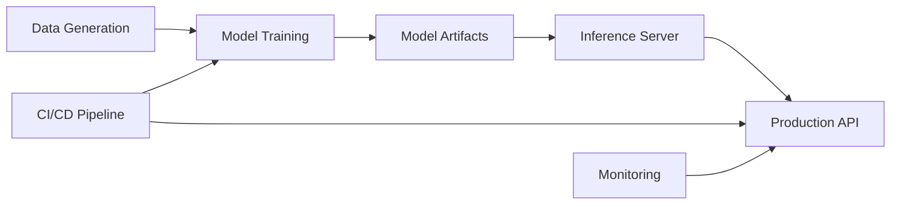

# Deployment & Monitoring Guide

This guide explains how to deploy and monitor your employee attrition prediction model using the working setup I've created.

## Architecture Overview



## Files Created

1. **[generate_data.py](file:///Users/krishnakumar/.gemini/antigravity/scratch/logistic_regression/generate_data.py)** - Generates synthetic training data
2. **[train_model.py](file:///Users/krishnakumar/.gemini/antigravity/scratch/logistic_regression/train_model.py)** - Trains model and saves artifacts
3. **[serve_model.py](file:///Users/krishnakumar/.gemini/antigravity/scratch/logistic_regression/serve_model.py)** - Production inference server
4. **[ml_pipeline.yml](file:///Users/krishnakumar/.gemini/antigravity/scratch/logistic_regression/ml_pipeline.yml)** - CI/CD configuration

---

## Deployment Setup

### Option 1: Local Deployment (Development)

**Step 1**: Train the model
```bash
cd /Users/krishnakumar/.gemini/antigravity/scratch/logistic_regression
python generate_data.py
python train_model.py
```

**Step 2**: Start the inference server
```bash
python serve_model.py
```
The server will run on `http://localhost:8000`

**Step 3**: Test the API
```bash
# In a new terminal
curl -X POST http://localhost:8000/predict \
  -H "Content-Type: application/json" \
  -d '{"features": [0.5, 0.3, 0.1, ...]}'  # 167 feature values
```

### Option 2: Production Deployment with Docker

**Step 1**: Create a Dockerfile
```dockerfile
FROM python:2.7-slim

WORKDIR /app

# Copy model artifacts and server code
COPY model_artifacts.json .
COPY serve_model.py .

EXPOSE 8000

CMD ["python", "serve_model.py"]
```

**Step 2**: Build and run
```bash
docker build -t attrition-predictor .
docker run -p 8000:8000 attrition-predictor
```

### Option 3: Cloud Deployment

**AWS Lambda + API Gateway**:
- Package `serve_model.py` and `model_artifacts.json` as a Lambda function
- Use API Gateway to expose the `/predict` endpoint
- Enable CloudWatch for monitoring

**Google Cloud Run**:
- Containerize with Docker
- Deploy to Cloud Run: `gcloud run deploy attrition-predictor --source .`

---

## CI/CD Pipeline

I've created **[ml_pipeline.yml](file:///Users/krishnakumar/.gemini/antigravity/scratch/logistic_regression/ml_pipeline.yml)** for GitHub Actions.

### Setup Instructions

**Step 1**: Move the pipeline file
```bash
mkdir -p .github/workflows
mv ml_pipeline.yml .github/workflows/
```

**Step 2**: Push to GitHub
```bash
git add .
git commit -m "Add ML pipeline with CI/CD"
git push origin main
```

The pipeline will automatically:
1. ✅ Generate data
2. ✅ Train the model
3. ✅ Validate artifacts
4. ✅ Deploy to production (on main branch)

---

## Monitoring Strategy

### 1. Model Performance Monitoring

Track these metrics over time:

| Metric | Target | Alert Threshold |
|--------|--------|-----------------|
| Accuracy | > 0.70 | < 0.65 |
| Precision | > 0.60 | < 0.50 |
| Recall | > 0.60 | < 0.50 |
| F1 Score | > 0.60 | < 0.55 |

**Implementation**:
```python
# Add to serve_model.py
import logging

def log_prediction(features, prediction, probability):
    logging.info({
        'timestamp': time.time(),
        'prediction': prediction,
        'probability': probability,
        'features_hash': hash(str(features))
    })
```

### 2. Data Drift Detection

Monitor if input data distribution changes over time.

**Method**: Track feature statistics
```python
# Weekly batch job
def check_drift():
    current_stats = calculate_feature_stats(recent_predictions)
    baseline_stats = load_training_stats()
    
    drift_score = calculate_drift(current_stats, baseline_stats)
    if drift_score > 0.1:
        alert("Data drift detected!")
```

### 3. Prediction Latency

Monitor API response times:
- **P50**: < 100ms
- **P95**: < 200ms
- **P99**: < 500ms

### 4. Business Metrics

Track real-world impact:
- % of employees flagged as high-risk who actually left
- Cost savings from early intervention
- Retention rate improvement

---

## Monitoring Tools

### Cloud Providers

**AWS**:
- CloudWatch Logs for prediction logging
- CloudWatch Metrics for latency tracking
- AWS X-Ray for request tracing

**Google Cloud**:
- Cloud Logging
- Cloud Monitoring
- BigQuery for analytics on predictions

### Open Source

**Prometheus + Grafana**:
```python
# Add metrics to serve_model.py
from prometheus_client import Counter, Histogram

predictions_total = Counter('predictions_total', 'Total predictions')
prediction_latency = Histogram('prediction_latency_seconds', 'Prediction latency')

@prediction_latency.time()
def predict_proba(features):
    predictions_total.inc()
    # ... existing code
```

**MLflow**:
- Track experiments
- Version models
- Deploy models to various platforms

---

## Alerts & Notifications

Set up alerts for:

1. **Model degradation**: F1 score drops below 0.55
2. **Data drift**: Feature distributions change > 10%
3. **System issues**: API latency > 1s
4. **High anomaly rate**: > 5% of predictions are uncertain (probability near 0.5)

**Example Slack Alert**:
```python
import requests

def send_alert(message):
    webhook_url = "YOUR_SLACK_WEBHOOK"
    requests.post(webhook_url, json={'text': message})

# In monitoring script
if f1_score < 0.55:
    send_alert("⚠️ Model F1 score dropped to {:.2f}".format(f1_score))
```

---

## Retraining Strategy

**Trigger retraining when**:
1. Model performance degrades below threshold
2. Significant data drift detected
3. Monthly scheduled retraining
4. New labeled data accumulated (e.g., 1000+ samples)

**Automated Retraining Pipeline**:
```yaml
# Add to ml_pipeline.yml
  retrain:
    runs-on: ubuntu-latest
    schedule:
      - cron: '0 0 1 * *'  # Monthly on 1st day
    
    steps:
      - name: Fetch new data
        run: python fetch_new_data.py
      
      - name: Retrain model
        run: python train_model.py
      
      - name: Validate model
        run: python validate_model.py
      
      - name: Deploy if better
        run: |
          if [ $NEW_MODEL_F1 > $CURRENT_MODEL_F1 ]; then
            python deploy_model.py
          fi
```

---

## Best Practices

1. **Version Control**: Track model versions with Git tags or MLflow
2. **A/B Testing**: Roll out new models gradually (e.g., 10% traffic initially)
3. **Rollback Plan**: Keep previous model artifacts for quick rollback
4. **Documentation**: Update this guide as your deployment evolves
5. **Security**: Use environment variables for sensitive configs, not hardcoded values

---

## Quick Reference

| Task | Command |
|------|---------|
| Train model | `python train_model.py` |
| Start server | `python serve_model.py` |
| Test API | `curl -X POST http://localhost:8000/predict -d '{"features": [...]}' -H "Content-Type: application/json"` |
| View logs | `tail -f server.log` |
| Check metrics | Visit `http://localhost:8000/metrics` (if Prometheus enabled) |
